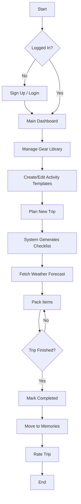
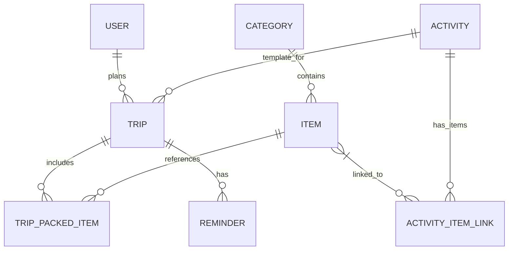

# PackSmart | Activity Packing Planner

PackSmart is a web application designed to help you plan your trips by generating customized packing lists based on the activities you'll be doing.

## Project Structure (Refactored)

The project follows a modular structure suitable for business environments:

```text
app/
├── api/                # API layer (v1 endpoints)
│   ├── deps.py         # Dependencies (get_db, etc.)
│   └── v1/
│       ├── api.py      # Main router inclusion
│       └── endpoints/  # Categorized routes (trips, activities, etc.)
├── core/               # App configuration (Pydantic Settings)
├── db/                 # Database connection and session management
├── models/             # SQLModel DB Models
├── schemas/            # Pydantic Schemas for validation and documentation
└── services/           # Business logic (PDF, Weather, Packing Logic)
main.py                 # Application entry point
```

## Features

- **User Authentication**: Secure your packing plans with a personal account.
- **Trip Planning**: Create trips by specifying a destination, start date, and activity.
- **Activity Templates**: Define reusable activity templates (e.g., Hiking, Golfing) with associated items.
- **Master Library**: Manage a global list of items with weights and categories.
- **Dynamic Checklists**: Automatically generate a packing checklist for every new trip.
- **Weight Tracking**: Monitor the total weight of your packed items.
- **Travel Memories**: Archive completed trips in a dedicated "Memories" tab.
- **Rating System**: Rate your past trips out of 5 stars and filter your history by rating.
- **Weather Integration**: Get a weather forecast for your destination to help you pack effectively.
- **PDF Export**: Export your final packing checklist as a PDF for easy access offline.

## Getting Started

### Prerequisites

- Python 3.7+
- All dependencies listed in `requirements.txt`

> **Note on Terminal Commands:**
> - **`py`**: Use this on Windows if you have the Python Launcher installed (standard with Python from python.org). It automatically finds the latest installed version of Python.
> - **`python`** or **`python3`**: Use these on Linux, macOS, or Windows if the Python Launcher is not installed or you have manually added Python to your PATH.

### Getting Started

1. Clone the repository.
2. Create and activate a virtual environment:
   ```bash
   py -m venv venv
   venv\Scripts\activate
   ```
3. Install dependencies:
   ```bash
   pip install -r requirements.txt
   ```
4. Seed the database and run the application:
   ```bash
   py main.py --seed
   ```

The application will be available at: [http://127.0.0.1:8000](http://127.0.0.1:8000)
API Documentation (Swagger UI): [http://127.0.0.1:8000/docs](http://127.0.0.1:8000/docs)

### Subsequent Runs

To start the app without re-seeding:
```bash
py main.py
```
### Test Account

Use the following credentials to log in and test the application:

- **Username**: `admin`
- **Password**: `password123`

## Tech Stack

- **Backend**: FastAPI (Python), SQLModel (SQLAlchemy + Pydantic)
- **Database**: SQLite
- **Frontend**: Vue.js 3 (located in `static/`)
- **Services**: Custom Weather Service, PDF Generation Service (fpdf2)
- **Configuration**: Pydantic Settings

## System Architecture

### Activity Diagram (User Flow)



### Database Schema (ERD)


