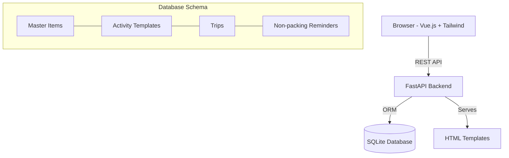

# Development Plan: Activity Packing Planner

## Overview
A reusable packing list manager that builds activity-based lists, calculates quantities based on trip duration, and tracks non-packing reminders.

## Tech Stack
- **Backend**: Python, FastAPI
- **Database**: SQLite (SQLAlchemy/SQLModel)
- **Frontend**: HTML5, Tailwind CSS, Vue.js (via CDN)

## Architecture

## Functional Requirements
1. **Master Library**: Centralized list of items (e.g., "Socks", "Golf Balls") that can be reused across activities.
2. **Activity Templates**: Pre-defined lists for specific purposes (e.g., "Golf Trip", "Scuba Diving").
3. **Smart Quantities**: Items in a trip have a base quantity (e.g., 1 pair of socks) which is multiplied by the trip duration (e.g., 5 days = 5 pairs).
4. **Reminders**: Tasks like "Turn off water" or "Feed the cat" that aren't packed but need to be done.
5. **Checklist Mode**: Interactive UI for ticking off items as they are packed.
6. **PDF Export**: Generate a clean PDF version of the packing list for printing.
7. **Categorization**: Group items by category (e.g., Toiletries, Electronics) for better organization.
8. **Weight Tracking**: Monitor the weight of individual items and the total weight of the packing list to ensure it stays within limits.
9. **Weather Forecast**: Integration with a weather API to provide a forecast for the trip's destination and dates, helping users pack more effectively.

## Implementation Steps
1. **Infrastructure**: Setup FastAPI and DB connection.
2. **Data Layer**: Define models for Items (with unit weight), Categories, Activities, Trips (with destination), and Reminders.
3. **Core Logic**: Implement the trip generation engine that applies duration multipliers and calculates cumulative weight totals.
4. **External Integrations**: Implement a weather fetching service to retrieve forecasts based on trip destination and dates.
5. **API Layer**: RESTful endpoints for all CRUD operations, state changes, weather data, and PDF generation.
6. **Frontend**: A responsive web interface built with Vue.js components loaded from CDN.
7. **PDF Integration**: Backend logic to render the trip checklist as a downloadable PDF file, organized by categories and including weight summaries.
